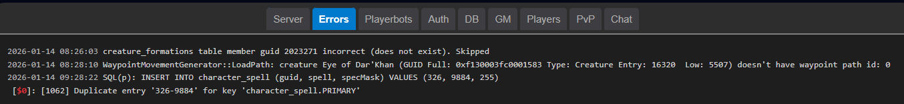

# Real-time-log-viewer
A simple PHP file that shows the logs you specify, in real-time, in a web browser. 
Built initially to show log files for AzerothCore, but it can be used for basically any set of log files that are stored in the same folder.

# How to use
Copy the logviewer.php file to your web folder somewhere, preferably in a folder that is protected with a username and password.
Open the logviewer.php file in a text editor, and specify these variables at the top of the file.

`$log_folder = '/your/folder/location';`  

`$refresh_timer = 3000;`  
`$tail_lines    = 50;`  

`$logs = [`  
`'Server'     => $log_folder . 'Server.log',`  
`'Errors'     => $log_folder . 'Errors.log',`  
`'Playerbots' => $log_folder . 'Playerbots.log',`  
`'Auth'       => $log_folder . 'Auth.log'`  

That's it! Easy as pie!

# Secure access

You may not always want everybody to see the contents of your log files, so securing the logviewer.php in some way is advised. If you are running it from an Apache webserver, this can easily be done by using a .htaccess file.
Simply create a new file in the same folder as the logviewer, and name it .htaccess. Here is an example of what the file should contain.

`AuthType Basic`  
`AuthName "Members Only"`  
`AuthUserFile /var/www/yourwebsite/logviewer/.htpasswd`  
`require valid-user`  

Then you must create the .htpasswd with a username and password. This is easily done by entering a command like this one

`htpasswd -c  /var/www/yourwebsite/logviewer/.htpasswd YOURUSERNAME`  
